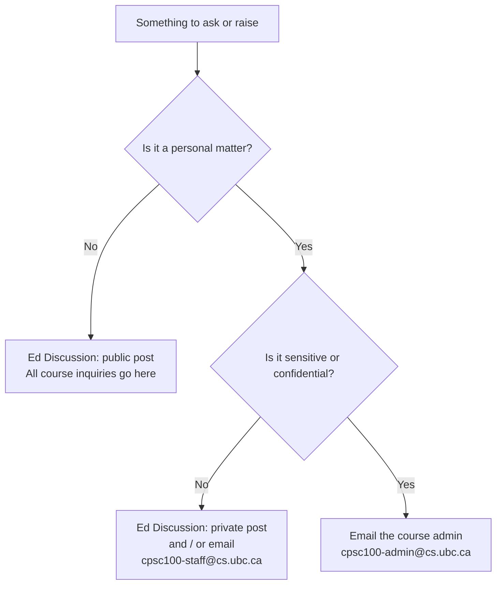

# Course Communication

Everything about how to reach the teaching team lives on this page. When in doubt, start with Ed Discussion.

> [!TIP]
> Sign up for the course discussion board using this link: *to be confirmed*. Make sure to use your UBC email address to sign up.

<!-- TODO: instructor decision required - Ed Discussion join link. A new join link is
     generated for each course instance; the 2024W2 link was
     https://edstem.org/us/join/PH2rqB and must not be reused. -->

## Where Should This Go?

## The Same Thing in Words

| Your situation | Where it goes |
| :------------- | :------------ |
| Anything relevant to the class: concepts, logistics, lab questions, deadlines, "how does this work?" | **Ed Discussion, public post.** Course staff check it daily, and the whole class benefits from the answer. |
| Something specific to you, but not sensitive: your group, your lab section, a submission question | **Ed Discussion, private post** (visible only to course staff) **and/or** email `cpsc100-staff@cs.ubc.ca` |
| Something sensitive or confidential: academic concessions, accessibility arrangements, personal or medical circumstances, academic integrity, conduct concerns | **Email `cpsc100-admin@cs.ubc.ca`** |

<!-- TODO: instructor decision required - confirm the staff vs admin split above. The
     sensitive-category examples are inferred from the syllabus and the CPSC 344
     precedent, where the -admin alias handled Centre for Accessibility exam
     arrangements. Misrouting a concession request has real consequences, so this list
     should be reviewed before the term starts. -->

**Why public first?** Most questions are not unique. Posting publicly means you get an answer faster, and the next person with the same question finds it already answered.

## Email Addresses

| Address | Use it for |
| :------ | :--------- |
| `cpsc100-staff@cs.ubc.ca` | Personal course matters that are not sensitive. Reaches the teaching team. |
| `cpsc100-admin@cs.ubc.ca` | Sensitive or confidential matters. |

> [!NOTE]
> This is the **only** page on the course site where email addresses are published. Every other page links here instead, so there is one place to keep current.

### Instructor

| Name | Email | Office Hours | Location |
| :--- | :---- | :----------- | :------- |
| **Parsa** Rajabi | prajabi [at] `DELETEthisTEXT` cs.ubc.ca | Mon 2:50-3:50pm · Wed 2:50-3:50pm · Fri 2:50-3:30pm | SWING 110 |

### Teaching Assistants

Each lab has a **lead TA** who runs the session and a **support TA** who assists. Every TA leads one lab and supports another.

| Name | Email | Leads | Supports |
| :--- | :---- | :---: | :------: |
| **Parsa** Seyfourian | parsa.seyfourian [at] `DELETEthisTEXT` ubc.ca | L1A | L1B |
| **Kate** Manskaia | emanskai [at] `DELETEthisTEXT` student.ubc.ca | L1B | L1C |
| **Tarvin** Arora | tarora13 [at] `DELETEthisTEXT` student.ubc.ca | L1C | L1D |
| **Jessica** He | xhe42 [at] `DELETEthisTEXT` student.ubc.ca | L1E | L1A |
| **Sally** Han | shan31 [at] `DELETEthisTEXT` student.ubc.ca | L1D | L1E |

For questions about your own lab, contact the **lead TA** for that section first.

Full profiles, lab times, and TA office hours are on the [Teaching Team](teaching-team.md) page.

> [!NOTE]
> There are two people named Parsa in this course: your instructor (Parsa Rajabi) and one of your TAs (Parsa Seyfourian). Please use full names in messages so we can route them correctly.

## Writing an Email That Gets a Fast Reply

Include all of these:

- A subject line with the course code, e.g. `[CPSC 100] Question about the group contract`
- A greeting
- A clear, specific message
- **Your full name and student number**
- A closing

Use your UBC email address so your message does not land in a spam folder.

Using AI/ChatGPT to generate emails is **not recommended**, and such emails will be returned for revision.

> [!WARNING]
> Before sending an email, review our [email etiquette guide](email-etiquette.md) and/or [How To Email Your Professor](https://personal.math.ubc.ca/~ilaba/teaching/email.html). **Emails that do not follow these guidelines will be returned to the sender for revision.**

## Please Do Not Email About

- **Waitlist position.** Waitlists are handled centrally by the Computer Science department. See [Course Waitlist](syllabus.md#course-waitlist). These emails will not be answered.
- **Asking for a higher grade** for non-academic reasons. See [Grade Solicitation Policy](syllabus.md#grade-solicitation-policy). If you believe a rubric was misapplied, use the [Remarking Policy](syllabus.md#remarking-policy) instead.

## A Note on Email vs. Conversation

Many course-related questions need back-and-forth, and email is a slow way to have a conversation. Office hours, lab time, and the discussion board will usually get you unstuck faster. Save email for things that are genuinely personal.

## Related

- [Email Etiquette](email-etiquette.md)
- [Teaching Team](teaching-team.md)
- [Code of Conduct](code-of-conduct.md)
- [Professionalism](syllabus.md#professionalism)
- [Privacy](syllabus.md#privacy) — how your data is handled by Ed Discussion
