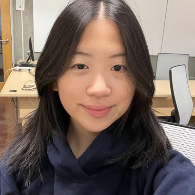

# Teaching Team

## Changelog

<!-- Add a dated entry every time a TA, pronoun, photo, or lab assignment changes. Newest first. -->

| Date | Update |
| :--: | :----- |
| Sep 24, 2026 | Added TA photos and pronouns. |

> [!TIP]
> **Looking for how to reach us?** Email addresses, the Ed Discussion link, and a flowchart showing where each kind of question belongs are all on [Course Communication](communication.md).

## Instructor

**Parsa Rajabi** — pronouns, office, and email are on the [syllabus](syllabus.md#course-instructor) and [Course Communication](communication.md). Drop-in hours are on the [Drop-in Hours](drop-in-hours.md) page.

## Teaching Assistants

Each lab has a **lead TA** who runs the session and a **support TA** who assists. Every TA leads one lab and supports another, so you will see two familiar faces each week.

For questions about your own lab, contact its **lead TA** first.

  

    
    
Parsa Seyfourian

    
he/him

    
Leads L1A Supports L1B

  

  

    
    
Kate Manskaia

    
she/her

    
Leads L1B Supports L1C

  

  

    
    
Tarvin Arora

    
she/her

    
Leads L1C Supports L1D

  

  

    
    
Sally Han

    
she/her

    
Leads L1D Supports L1E

  

  

    
    
Jessica He

    
she/her

    
Leads L1E Supports L1A

  

Lab section times and the room are on the [Labs](labs.md) page. Who is holding drop-in hours, when, and where is on the [Drop-in Hours](drop-in-hours.md) page.

TAs are also available during your scheduled lab time. Note that during lab, TAs prioritize helping students with that week's lab work.

## Related

- [Course Communication](communication.md) — email addresses and where to send what
- [Drop-in Hours](drop-in-hours.md) — when and where to find us in person
- [Labs](labs.md) — section times, room, and how labs are graded
- [Code of Conduct](code-of-conduct.md)
